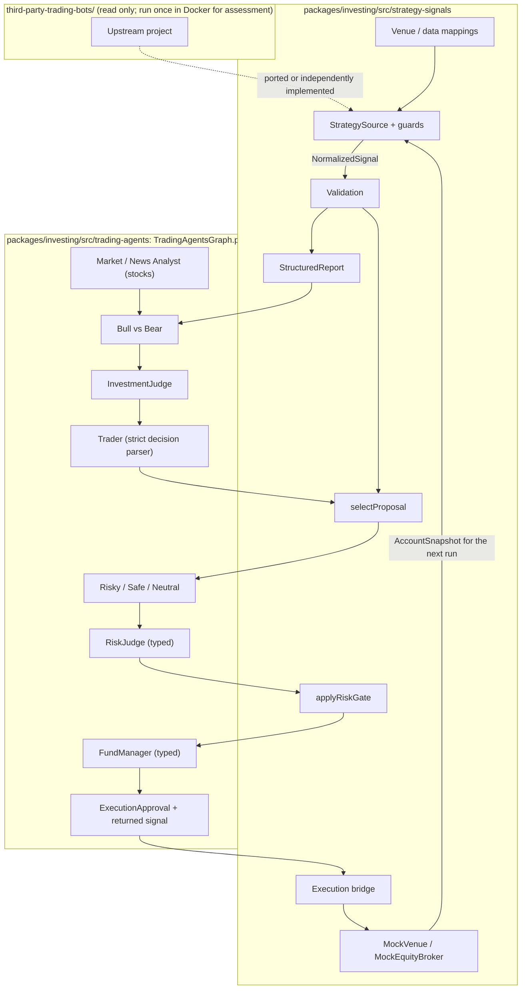

# Design Brief: Third-Party Bot Integration into `packages/investing`

**Version 2** (2026-10-05)
**Safety level:** standard. The work is paper-only, but risk limits are treated as safety-critical.
**Project type:** evolution of an existing system.

This brief explains the shape of the design and why. The exact contracts, steps and tests are in the implementation plan, [`../plans/third-party-bot-integration.md`](../plans/third-party-bot-integration.md). **Where the two differ, the plan is authoritative.** The evidence is in [`../findings/`](../findings/).

## Executive Summary

The projects in `third-party-trading-bots/` are vendored prior art, and nothing in the app uses them. Each folder now contributes selected pure TypeScript logic or a model mapping inside `packages/investing`, behind one envelope built from existing package types. Complete licensed decision cores are translated; incomplete notices use independent implementations. The source-level graph now connects the risk team, a binding judge and the Fund Manager behind opt-in risk review, with a deterministic gate. Execution consumes one approved, identified proposal through credential-free mocks. The app and built package are outside the demonstrated integration.

## Requirements

### Functional

1. **All 10 folders connect to `packages/investing`, each by its kind:**
   - strategy bots become signal sources;
   - the agent frameworks contribute one deterministic piece each;
   - the venue SDKs and the data layer become mapped interfaces with mocks.
2. **Bot output reaches the chain as analyst input.** Analyst → Research Manager (`InvestmentJudge`) → Trader → risk team → Portfolio Manager (`FundManager`).
3. **All 4 output kinds can be consumed:** signals, recommendations, orders and portfolio suggestions.
4. **One graph** handles both stocks and prediction-market contracts.
5. **One end-to-end demo with no credentials, no network and no live trading.** It also shows that the bot is connected, not merely copied.
6. **Venue- and broker-specific code stays out of the core agents.**

### Non-functional

- **Determinism:** sources are pure functions of their input, with an explicit evaluation time and no clock. Tests and the demo use a scripted LLM.
- **Compatibility:** the 2 existing API callers keep their behavior and their prompts, byte for byte, unless they opt in. The one exception is the decision-parser fix, which only removes false BUYs.
- **Runtime:** the new module uses no Node built-ins. The package must keep working on Cloudflare Workers and in Node or Bun.
- **Repository rules:** nothing in `third-party-trading-bots/` is edited or imported. Translated code keeps its upstream notice, and the notice ships.
- **Untrusted input:** adapter output, venue data, configuration and LLM text are all validated before anything reaches an order.

## Architecture

### Components

**Envelope (`types.ts`).** `NormalizedSignal` is one envelope whose parts are existing types:

| Part | Existing type it reuses |
|---|---|
| `action`, `confidence`, `reasoning` | The same fields as `TradeSignal`. `asOf` is an ISO string, and `toTradeSignal()` converts it. |
| `order` | `PredictionMarketTradeIntent` |
| `targets` | `PaperPosition` fields, plus a price |
| The report | Built as a `StructuredReport` (defined in the package but unused until now), then formatted to text |

- **Forecast:** `probability` is always P(YES), and only from a real model estimate.
- **Price precision:** strategy prices keep their upstream precision, as decimal cents. Only execution requires whole cents, and it rejects anything else instead of rounding it.

**Sources.** `StrategySource.run(input, context)` is pure.
- **Context:** it holds the current `AccountSnapshot` (per venue for event contracts, or cash and shares for stocks) and the evaluation time.
- **Guards:** each source declares its own guards, for rules that only make sense for that strategy (for example, Vibe's forecast-based Kelly and edge rules, or BTC's $1 position cap).
- **Holdings:** a source reads its holdings from the context. It never assumes that its own past orders filled. Weighted average account costs can be fractional even though executable fill prices are whole cents.
- **Registration:** executable third-party proposals require their source in the run registry; missing registration denies execution so source guards cannot be skipped.

**Proposal selection.** `selectProposal` is called once per run. It turns the Trader's direction plus the agreeing signals into exactly one `TradeProposal` with a stable `proposalId`, or into "report only, with a reason".
- **One leg at a time:** portfolio targets yield their next unfilled leg. A hedge advances only from real fills.

**Risk.**
- **Common checks for every source:** current cash, position caps, an open-position limit, posture, and exits that are always allowed.
- **Source guards** then apply.
- **Binding decisions:**
  - the `RiskJudge` answers PROCEED, BLOCK or REDUCE with a whole number;
  - the `FundManager` answers APPROVE, REJECT or MODIFY with a quantity and the proposal ID;
  - both are parsed strictly, and anything malformed means no approval.
- **Final quantity:** the minimum of all caps.
- **Returned signal:** the graph returns a signal built from the final state.

**Execution.**
- **Input:** it consumes only the `ExecutionApproval`.
- **Event contracts:** one intent into the venue's own `MockVenue`, which fills at the ask or bid. There is one paper executor per venue.
- **Stocks:** an Alpaca-shaped order into `MockEquityBroker`, after an affordability check. A real `createAlpacaClient({ paper: true })` has the same call shape.

**Prompts.**
- **Stocks:** the existing prompts, plus one strategy-signals line when signals are given.
- **Event contracts:** separate prompt variants that carry the market question, the outcome, the P(YES) convention, the quote and the closing time. They contain no company-growth or valuation instructions.

## Per-folder integration map

| Folder | Kind | Integration |
|---|---|---|
| `kalshi-bot-api` | SDK + example | The existing momentum port becomes the reference source. The PyKalshi `Market` model is mapped to `VenueMarket`, with both quote sides kept. |
| `Kalshi-Vibe-Bot` | Strategy | A source over recorded model P(YES), with guards for its minimums, ceilings, calibration block and full Kelly sizing |
| `poly-bot-gabagool` | Strategy | A portfolio-kind source (YES and NO targets), executed one leg at a time from actual average costs |
| `Polymarket-BTC-15-Minute-Trading-Bot` | Strategy | The weighted fusion source, with the time window measured from the evaluation time, and a guard for its own position and exposure limits |
| `Prediction-Markets-Trading-Bot-Toolkits` | Strategy (Rust) | The copy-trade sizing in `src/service/strategy.rs`. 8 of its 10 advertised strategies are stubs. |
| `poly-bot-openclaw` | Strategy framework | The Survival Manager state machine as a risk posture, with a documented demo multiplier table |
| `ai-hedge-fund` | Agent framework | The deterministic technicals analyst as a recommendation source |
| `debate-agents` | Agent framework | An independent red-flag scorer as advisory input (no license, so no translated code) |
| `polymarket-exec-api` (pmxt) | SDK | Its market model mapped to `VenueMarket`; sub-cent ticks kept; non-binary markets rejected |
| `fin-data-api-python` (OpenBB) | Data layer | Its historical-price model mapped to `StockData`, with a defined policy for null volume |

Every folder is also run once, in a locked-down Docker container in its own demo mode, to record its real runtime and blockers. Nothing in `packages/investing` ever starts a bot.

## Technology Decisions

| Decision | Choice | Reasoning |
|---|---|---|
| How bot logic arrives | Port, or implement independently, behind sources | Repository rule; Workers runtime; precedent (PR #199). See ADR 0001. |
| Contract | One envelope composed of existing types | The task asks for "the data structures … already used by the investing package" |
| Risk | LLM debate + typed judge + deterministic gate + typed Fund Manager; final quantity = minimum of all caps | LLM text can never exceed a limit. See ADR 0002. |
| Selection | One proposal per run, bound by ID through approval and execution | Prevents executing something other than what was approved |
| Holdings | A per-run account snapshot per venue | Correct exits; no stale state; no sharing across venues |
| Precision | Decisions keep full precision; execution needs whole cents and never rounds | Keeps real strategy boundaries (for example 0.499) |
| New behavior | Opt-in | The existing API routes keep their cost and output |
| Execution environment | Docker derived from pinned `oven/bun:1.3.11` with Node/native build prerequisites; checks run offline | Matches the repository's Bun pin; proves zero network at the OS level |

## Security and Safety

- **No credentials anywhere.** Real clients are out of scope.
- **Assessment runs** use a staged copy without secret files, an offline run stage, and no host mounts beyond their own work folder.
- **The dev-server run** uses an empty environment, and its log is sanitized before it is saved.
- **All limits live in code** and are pinned by tests.

## Risks

See the plan's "Risks & Rollback" table. In short, the main design risks are these:
- **Port drift:** mitigated by goldens from upstream runs or tests.
- **Incomplete license evidence:** mitigated by the independent-implementation fallback.
- **LLM output overriding limits:** prevented by typed parsing and the minimum-of-caps rule.

## Known Limits

These limits are documented, not solved:
- **The built package and its subpath exports are broken today.** This work validates only from source modules.
- **No Workers runtime test.** The new module avoids Node APIs, but that is not proven on Workers.
- **No execution ledger, portfolio versioning or concurrency control.** A live deployment would need them.
- **Sub-cent execution is not supported** by the paper executor.

## Delivered implementation and workflow

All ten folder contributions are consumed by fixture-based graph runs; the combined demo includes event sources, stock BUY/SELL, sequential hedging and Defensive posture. Native assessment results, complete per-folder inventory, setup blockers and consumer paths are in the required [overview](../../third-party-trading-bots-overview.md). Numerical goldens include original Python technicals and original Rust sizing expectations; the policy changes for red flags and survival multipliers are explicitly labeled.

Build workflow (decided 2026-10-05): the three Phase B tracks worked on bounded file sets in this checkout instead of separate worktrees, and the changes were left uncommitted for review. Raw logs and the PR draft stay local.

Validation is from source leaves. The old 86 source diagnostics remain; full test/example diagnostics were also reproduced against untouched upstream and gated by identity/occurrence. Root dev was attempted, but its HTTP 200 belonged to Financial Data API and MCP registration failed. Pure-module checks do not prove Workers or the web app operational.
